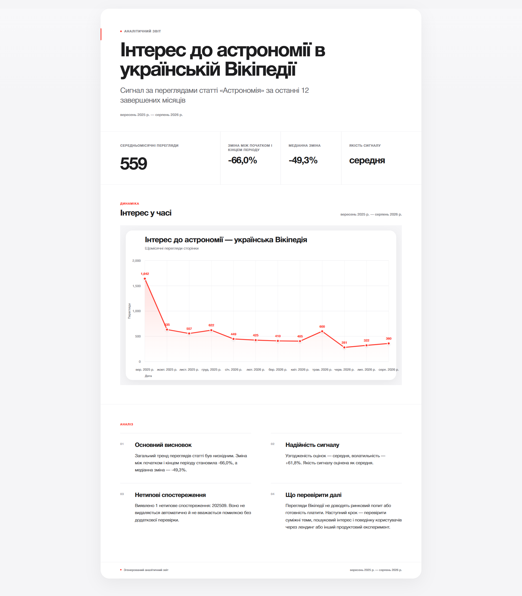
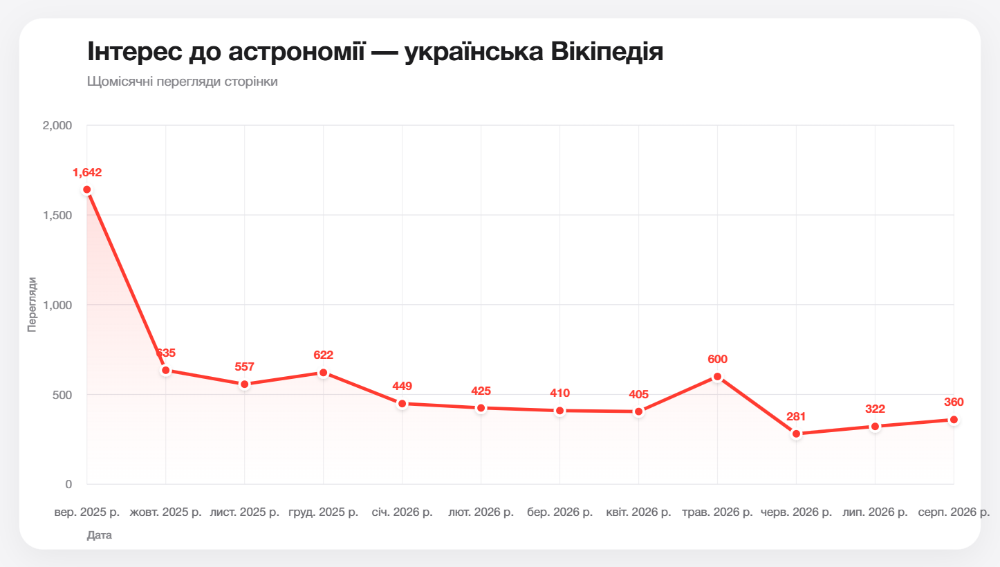
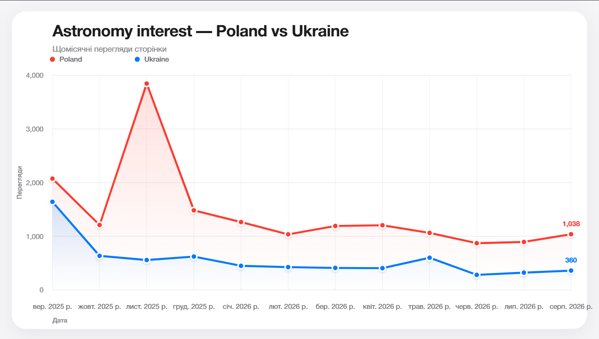
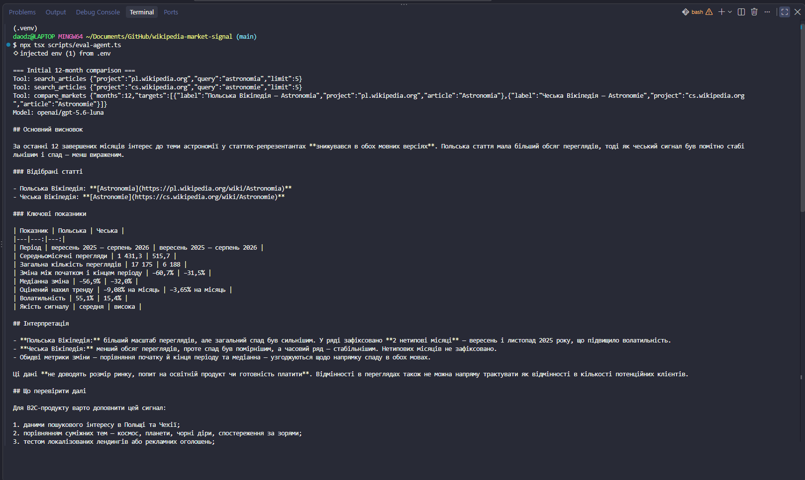
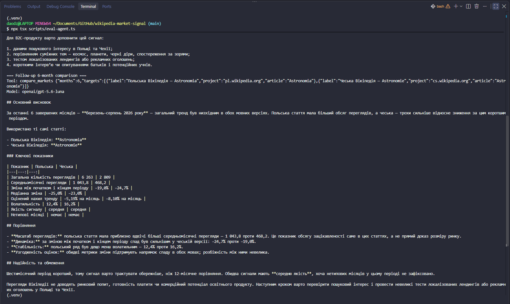

# Wikipedia Market Signal

A standalone **Agent Skill** for using Wikipedia page-view trends as an early market-research signal.

The skill searches for relevant Wikipedia articles, retrieves real monthly page-view data from Wikimedia, calculates deterministic trend metrics, compares language editions, generates charts, and produces short shareable HTML/PDF reports.

It is designed for B2C founders and product researchers who want a fast signal for deciding which topics or language markets deserve deeper investigation.

> Wikipedia page views are an **interest proxy**, not proof of market demand, purchase intent, willingness to pay, or market size.



## What it does

The skill supports:

- searching Wikipedia article candidates for a topic;
- analyzing one article over completed calendar months;
- comparing the same topic across multiple Wikipedia language editions;
- calculating growth, median-based growth, trend slope, volatility, outliers, signal consistency, and heuristic signal quality;
- generating single-market and multi-market SVG charts;
- generating a shareable HTML report and a two-page A4 landscape PDF;
- follow-up requests that reuse the previously selected articles and recompute only the changed assumptions.

### Single-market example



### Multi-market example



## Why Wikipedia?

Wikipedia page views are public, language-specific, available through Wikimedia APIs, and useful as a lightweight behavioral signal.

That makes them useful for questions such as:

- Is attention to a topic rising or falling?
- Does the signal look different across language editions?
- Is the observed trend stable or dominated by unusual months?
- Which topics or markets deserve deeper validation?

The skill deliberately avoids turning page views into claims about revenue, demand, conversion, or willingness to pay.

## Agent workflow

The intended workflow is:

```text
User question
    ↓
Search Wikipedia candidates
    ↓
Select the semantically correct article
    ↓
Fetch real Wikimedia page-view data
    ↓
Calculate deterministic metrics
    ↓
Interpret the signal using SKILL.md + references/interpretation.md
    ↓
Optional comparison / chart / report
    ↓
Explicit limitations + suggested next validation
```

For multi-market analysis, the agent searches each language edition first and then calls the comparison workflow directly. It does not need to run redundant per-market analyses before comparison.

For follow-up requests, previously established article selections are reused unless the user explicitly changes the topic or article.

## Installation

Requirements:

- Node.js 20+ recommended
- npm
- Chromium installed through Playwright for PDF generation
- Python only if you want to run the official `skills-ref` validator

Install dependencies:

```bash
npm install
```

Install the Playwright Chromium browser used for PDF generation:

```bash
npx playwright install chromium
```

## Quick start

### Analyze one Wikipedia article

```bash
npx tsx scripts/analyze.ts \
  --project=uk.wikipedia.org \
  --article=Астрономія \
  --months=12 \
  --format=table
```

JSON output:

```bash
npx tsx scripts/analyze.ts \
  --project=uk.wikipedia.org \
  --article=Астрономія \
  --months=12 \
  --format=json
```

### Search for article candidates

```bash
npx tsx scripts/search-articles.ts \
  --project=uk.wikipedia.org \
  --query=астрономія \
  --limit=5
```

The agent should not blindly choose the first search result when the topic is semantically ambiguous.

### Compare language markets

```bash
npx tsx scripts/compare-markets.ts \
  --months=12 \
  --targets="Poland|pl.wikipedia.org|Astronomia,Ukraine|uk.wikipedia.org|Астрономія"
```

The comparison reports differences in scale, direction, volatility, consistency, outliers, and signal quality without automatically declaring a universal winner.

## Generate charts

### Single market

```bash
npx tsx scripts/generate-chart.ts \
  --project=uk.wikipedia.org \
  --article=Астрономія \
  --months=12 \
  --title="Інтерес до астрономії — українська Вікіпедія" \
  --output=output/chart-single-market-ukraine.svg
```

### Multiple markets

```bash
npx tsx scripts/generate-chart.ts \
  --months=12 \
  --targets="Poland|pl.wikipedia.org|Astronomia,Ukraine|uk.wikipedia.org|Астрономія" \
  --title="Astronomy interest — Poland vs Ukraine" \
  --output=output/chart-multi-market-poland-vs-ukraine.svg
```

Generated runtime artifacts are intentionally written to `output/`, which is ignored by Git.

## Generate a shareable report

The report renderer accepts structured JSON with:

```text
title
subtitle
periodLabel
metrics[]
sections[]
```

Generate HTML:

```bash
npx tsx scripts/generate-report.ts \
  --input=output/report.json \
  --chart=output/chart-single-market-ukraine.svg \
  --output=output/report.html
```

Generate PDF:

```bash
npx tsx scripts/generate-pdf.ts \
  --input=output/report.html \
  --output=output/report.pdf
```

The PDF uses an intentional two-page A4 landscape layout:

```text
Page 1 → title + period + key metrics + chart
Page 2 → interpretation + reliability + outliers + next validation steps
```

## Metrics and interpretation

All numerical metrics are calculated by code. The model is expected to interpret tool output rather than manually recalculate metrics.

`growthPct` compares the average of the first three months with the average of the last three months.

`medianGrowthPct` performs the same comparison using medians, reducing sensitivity to unusual months.

`growthDisagreementPct` measures the difference between those two estimates.

`trendSlopePctPerMonth` is a normalized linear-regression slope. It describes the fitted historical direction; it is **not** compounded monthly growth and **not** a forecast.

`volatilityPct` is the population standard deviation divided by the mean.

Outliers are detected using the IQR rule. An outlier is an unusual observation, not automatically an error and not automatically removed.

`signalConsistency` is a heuristic based on agreement between the mean-based and median-based growth estimates. It is not statistical confidence.

`signalQuality` is a transparent heuristic based on period length, consistency, volatility, and outlier share. It is not a probability or forecast certainty.

## Important limitations

The skill intentionally keeps these assumptions visible:

- one Wikipedia article is only a proxy for a broader topic;
- the same concept may have different coverage or audience behavior across language editions;
- raw views across languages are not normalized market-size estimates;
- an unusual month does not reveal its cause;
- the analysis is historical and does not forecast future demand;
- Wikipedia attention does not prove product demand, conversion, revenue, or willingness to pay.

For a product decision, Wikipedia should be combined with other evidence such as search-interest data, product analytics, landing-page or advertising experiments, interviews, and related-topic analysis.

## Agent Skill structure

```text
wikipedia-market-signal/
├── SKILL.md
├── references/
│   └── interpretation.md
├── scripts/
│   ├── analysis.ts
│   ├── analyze.ts
│   ├── chart.ts
│   ├── compare.ts
│   ├── compare-markets.ts
│   ├── dates.ts
│   ├── eval-agent.ts
│   ├── eval-artifact.ts
│   ├── eval-skill.ts
│   ├── generate-chart.ts
│   ├── generate-pdf.ts
│   ├── generate-report.ts
│   ├── metrics.ts
│   ├── openrouter-smoke-test.ts
│   ├── report-html.ts
│   ├── report.ts
│   ├── search-articles.ts
│   ├── search.ts
│   └── wikipedia.ts
├── tests/
│   ├── dates.test.ts
│   └── metrics.test.ts
├── assets/
│   ├── agent-eval-follow-up.png
│   ├── agent-eval-initial.png
│   ├── chart-multi-market-poland-vs-ukraine.png
│   ├── chart-single-market-ukraine.png
│   └── report-preview.png
├── package.json
└── tsconfig.json
```

## Validation

### Automated tests

```bash
npm test
```

Current test coverage checks:

- completed-month date ranges;
- year boundaries;
- invalid month counts;
- clear upward and downward trends;
- strong outlier detection;
- rejection of periods shorter than six months.

### TypeScript

```bash
npm run typecheck
```

### Official Agent Skills validator

From the parent directory:

```bash
skills-ref validate wikipedia-market-signal
```

Expected result:

```text
Valid skill: wikipedia-market-signal
```

## Model evaluation

The skill was iteratively evaluated with low-cost models through OpenRouter.

The evaluation process included:

- a smoke test for API connectivity;
- a structured interpretation test using known deterministic analysis output;
- an end-to-end tool-calling scenario where the model searched Wikipedia, selected the article, called analysis tools, and produced a Ukrainian founder-oriented answer;
- a multi-market Poland-vs-Czechia scenario;
- a follow-up scenario changing the analysis window from 12 to 6 completed months while reusing the same articles;
- an artifact evaluation that generated real SVG, HTML, and PDF output and verified that the files were created.

The full tool-calling scenario was successfully run with `openai/gpt-5.6-luna`.

`anthropic/claude-haiku-4.5` was also used during interpretation testing. Free shared-model routes were tested as well, but some runs encountered upstream rate limits, which is one reason the final validation uses a fixed low-cost model instead of relying on an unstable free routing pool.

### End-to-end tool calling

The initial request shows the model searching both language editions and then calling the comparison tool:



The follow-up reuses the same articles and reruns only the comparison with a six-month window:



The most important validation rule was simple: **models never become the source of numerical truth**. Metrics come from deterministic TypeScript code; the model interprets those results.

## Environment for model evals

Model eval scripts use:

```text
OPENROUTER_API_KEY
```

Store it locally in `.env`:

```bash
OPENROUTER_API_KEY=your_key_here
```

`.env` is ignored by Git and must never be committed.

## Roadmap

The current implementation is intentionally focused and reproducible. Natural next steps are:

- topic baskets instead of one-article proxies;
- Wikidata/interlanguage-link resolution for stronger cross-language semantic matching;
- normalized-index charts for comparing trend shape across markets with very different absolute traffic;
- year-over-year and seasonality-aware comparisons;
- caching and batching for larger research workloads;
- broader evidence layers such as search trends, product analytics, or first-party experiments;
- richer report templates for multi-market studies.

## Design principle

The skill is not a market oracle.

Its job is to turn public Wikipedia behavior into a transparent, reproducible signal that helps a founder decide **what to investigate next**.
